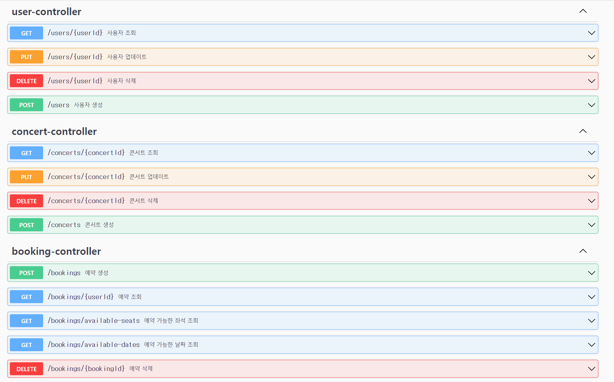
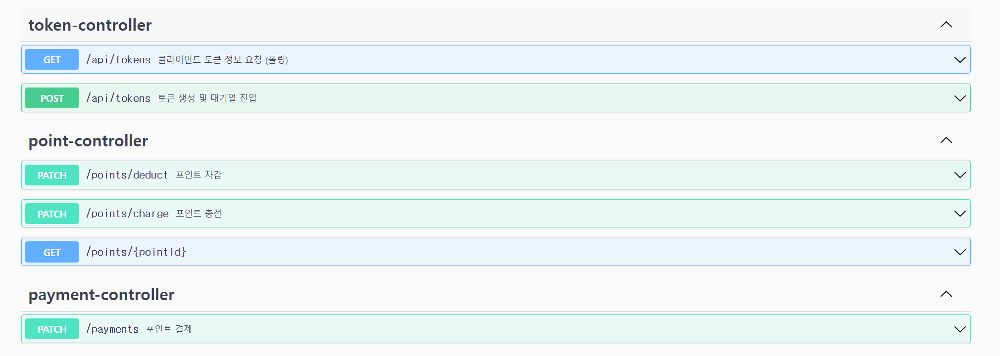
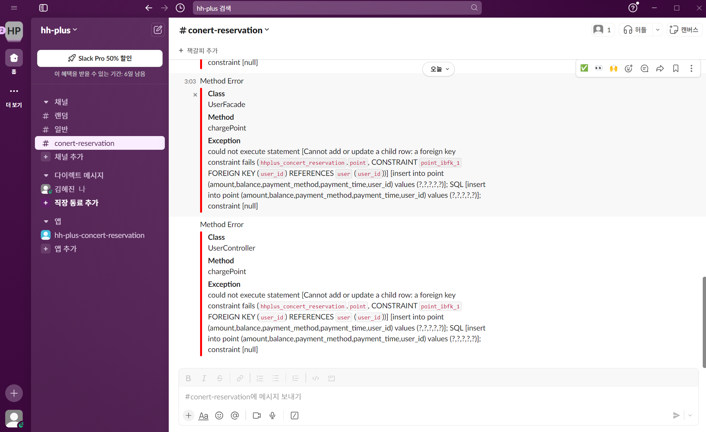
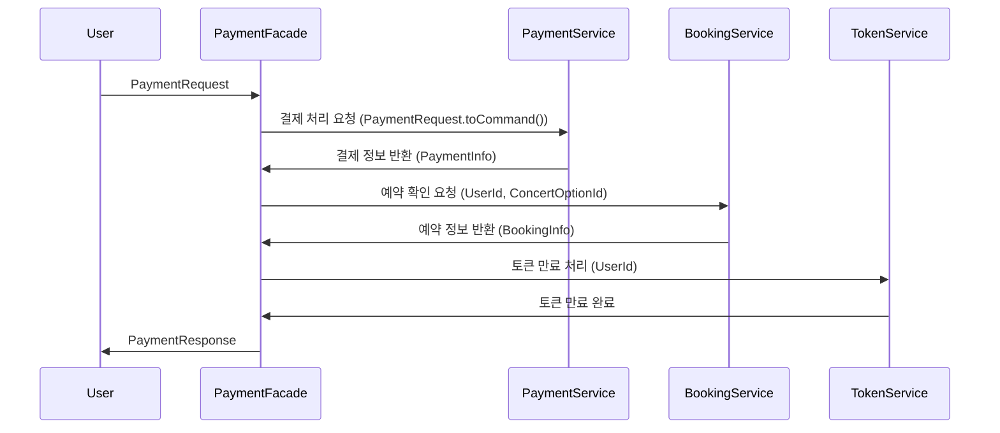

# hhplus-concert-reservation
항해플러스 3주차 콘서트 예약 프로젝트

<details>
  <summary>시퀀스 다이어그램</summary>

### 1. 유저 토큰 발급 API


### 2. 예매 가능 날짜 조회 API


### 3. 해당 날짜의 좌석 조회 API


### 4. 좌석 예매 요청 API


### 5. 잔액 조회 API


### 6. 잔액 충전 API


### 7. 결제 API


</details>

<details>
  <summary>ERD</summary>

## ERD 구성 요소
### User Table (유저 테이블)
| 필드명  | 영문명     | 타입     | NOT NULL |
|---------|------------|----------|----------|
| 유저 ID | user_id    | varchar  | YES      |
| 이름    | name       | varchar  | YES      |
| 이메일  | email      | varchar  | YES      |

### Token Table (유저 토큰 테이블)
| 필드명        | 영문명        | 타입      | NOT NULL |
|---------------|---------------|-----------|----------|
| 토큰 ID       | token_id      | bigint    | YES      |
| 유저 ID       | user_id       | varchar   | YES      |
| 콘서트 코드   | concert_code  | varchar   | YES      |
| 유효 시간     | expiration_time | timestamp | YES     |

### Concert Table (콘서트 테이블)
| 필드명        | 영문명        | 타입      | NOT NULL |
|---------------|---------------|-----------|----------|
| 콘서트 ID     | concert_id    | bigint    | YES      |
| 이름          | name          | varchar   | YES      |
| 날짜          | date          | date      | YES      |

### Seat Table (좌석 테이블)
| 필드명        | 영문명        | 타입      | NOT NULL |
|---------------|---------------|-----------|----------|
| 좌석 ID       | seat_id       | bigint    | YES      |
| 콘서트 ID     | concert_id    | bigint    | YES      |
| 좌석 번호     | seat_number   | int       | YES      |
| 예약 여부     | is_reserved   | boolean   | YES      |

### Reservation Table (예약 테이블)
| 필드명       | 영문명            | 타입        | NOT NULL |
|-----------|-------------------|-----------|----------|
| 예약 ID     | reservation_id    | bigint    | YES      |
| 콘서트 옵션 Id | concertOptionId | bigint        | YES      |
| 유저 ID     | user_id           | varchar   | YES      |
| 좌석 ID     | seat_id           | bigint    | YES      |
| 예약 시간     | reservation_time  | timestamp | YES      |
| 예약 확정 여부  | is_confirmed      | boolean   | YES      |

### Point Table (포인트 테이블)
| 필드명        | 영문명     | 타입      | NOT NULL |
|---------------|------------|-----------|----------|
| 포인트 ID     | point_id   | bigint    | YES      |
| 유저 ID       | user_id    | varchar   | YES      |
| 잔액          | amount     | decimal   | YES      |

### TempReservation Table (임시 예약 테이블)
| 필드명                | 영문명                | 타입      | NOT NULL |
|-----------------------|-----------------------|-----------|----------|
| 임시 예약 ID          | temp_reservation_id   | bigint    | YES      |
| 유저 ID               | user_id               | varchar   | YES      |
| 좌석 ID               | seat_id               | bigint    | YES      |
| 임시 예약 시간        | temp_reservation_time | timestamp | YES      |
| 만료 시간             | expiration_time       | timestamp | YES      |

### Queue Table (큐 테이블)
| 필드명          | 영문명     | 타입      | NOT NULL |
|-----------------|------------|-----------|----------|
| 큐 ID           | queue_id   | bigint    | YES      |
| 유저 ID         | user_id    | varchar   | YES      |
| 콘서트 ID       | concert_id | bigint    | YES      |
| 큐 등록 시간    | queue_time | timestamp | YES      |
| 대기열 위치     | position   | int       | YES      |

**설명**

1. USER는 여러 TOKEN을 가질 수 있습니다.
2. USER는 여러 RESERVATION을 할 수 있습니다.
3. USER는 하나의 POINT를 가집니다.
4. USER는 여러 TEMP_RESERVATION을 할 수 있습니다.
5. USER는 여러 QUEUE를 가질 수 있습니다.
6. CONCERT는 여러 SEAT를 포함합니다.
7. CONCERT는 여러 QUEUE를 포함합니다.
8. SEAT는 여러 RESERVATION에 포함될 수 있습니다.
9. SEAT는 여러 TEMP_RESERVATION에 포함될 수 있습니다.
</details>

<details>
  <summary>API Documentation</summary>

## 유저 토큰 발급 API

### Request

- **Method**: POST
- **URL**: `http://localhost:8082/mock/queue`
- **Content-Type**: application/json

```json
{
  "userId": "spring123",
  "requestedTime": "2024-07-03T10:00:00",
  "priority": 2
}
```

### Response

- **Status Code**: 200
- **Content-Type**: application/json

```json
{
  "queueToken": "ca20bc2a-577b-4055-ab3b-7e197c668b35",
  "position": 0,
  "issueTime": [
    2024,
    7,
    5,
    1,
    55,
    10,
    816342400
  ],
  "expirationTime": [
    2024,
    7,
    5,
    2,
    0,
    10,
    816342400
  ],
  "queueStatus": "PROCESSING"
}
```

## 예약 가능한 날짜 목록 조회 API

### Request

- **Method**: GET
- **URL**: `http://localhost:8082/mock/concerts`

### Response

- **Status Code**: 200
- **Content-Type**: application/json

```json
{
  "concerts": [
    {
      "concertId": 1,
      "name": "concertA",
      "date": [
        2024,
        7,
        6,
        1,
        55,
        12,
        127111700
      ],
      "seats": [
        {
          "seatId": 0,
          "seatNumber": 1,
          "reserved": false
        },
        ...
      ]
    },
    ...
  ]
}
```

## 특정 날짜의 예약 가능한 좌석 목록 조회 API

### Request

- **Method**: GET
- **URL**: `http://localhost:8082/mock/available-seats?concertId=1&date=2024-07-10`

### Response

- **Status Code**: 200
- **Content-Type**: application/json

```json
[
  {
    "seatId": 0,
    "seatNumber": 1,
    "reserved": false
  },
  ...
]
```

## 좌석 예약 요청 API

### Request

- **Method**: POST
- **URL**: `http://localhost:8082/mock/booking`
- **Content-Type**: application/json
- **Headers**:
    - `Queue-Token`: your-queue-token

```json
{
  "userId": 1,
  "concertOptionId": 1,
  "seats": "A_10,A_11"
}
```

### Response

- **Status Code**: 200
- **Content-Type**: application

/json

```json
{
  "responseResult": "SUCCESS",
  "bookingId": 1,
  "bookingStatus": "COMPLETE",
  "bookingTime": [
    2024,
    7,
    5,
    1,
    55,
    14,
    863645100
  ],
  "user": {
    "userId": 1,
    "name": "UserA",
    "balance": 100000
  },
  "concert": {
    "concertId": 1,
    "name": "concertA",
    "date": [
      2024,
      7,
      10,
      1,
      55,
      14,
      863645100
    ],
    "seats": [
      {
        "seatId": 0,
        "seatNumber": 10,
        "reserved": true
      },
      {
        "seatId": 1,
        "seatNumber": 11,
        "reserved": true
      }
    ]
  }
}
```

## 잔액 충전 API

### Request

- **Method**: POST
- **URL**: `http://localhost:8082/mock/balance`
- **Content-Type**: application/json

```json
{
  "userId": 1,
  "balance": 100.00
}
```

### Response

- **Status Code**: 200
- **Content-Type**: application/json

```json
{
  "userId": 1,
  "name": "아무개",
  "balance": 100
}
```


## 잔액 조회 API

### Request

- **Method**: GET
- **URL**: `http://localhost:8082/mock/balance/1`

### Response

- **Status Code**: 200
- **Content-Type**: application/json

```json
{
  "userId": 1,
  "name": "아무개",
  "balance": 10000
}
```

## 결제 API

### Request

- **Method**: POST
- **URL**: `http://localhost:8082/mock/payment`
- **Content-Type**: application/json
- **Headers**:
    - `Queue-Token`: your-queue-token

```json
{
  "bookingId": 12345,
  "concertId": 1,
  "userId": 1001,
  "seats": "A_10,A_11"
}
```

### Response

- **Status Code**: 200
- **Content-Type**: application/json

```json
{
  "responseResult": "SUCCESS",
  "bookingResponse": {
    "responseResult": "SUCCESS",
    "bookingId": 12345,
    "bookingStatus": "COMPLETE",
    "bookingTime": [
      2024,
      7,
      5,
      1,
      57,
      40,
      281699400
    ],
    "user": {
      "userId": 1001,
      "name": "UserA",
      "balance": 100000
    },
    "concert": {
      "concertId": 1,
      "name": "concertA",
      "date": [
        2024,
        7,
        10,
        1,
        57,
        40,
        281699400
      ],
      "seats": [
        {
          "seatId": 0,
          "seatNumber": 10,
          "reserved": true
        },
        {
          "seatId": 1,
          "seatNumber": 11,
          "reserved": true
        }
      ]
    }
  }
}
```


</details>
<details>
  <summary>마일스톤</summary>
# 마일스톤

https://github.com/hyejin0662/hhplus-concert-reservation/milestones
</details>
<details>
  <summary>swagger</summary>
# swagger
http://localhost:8082/swagger-ui/index.html



</details>

<details>


 <summary> 예외 slcak 알림 </summary>


(에러 로그 내용은 추후 고도화하겠습니다 ^^..!)
</details>


<details>
<summary> 회고 </summary>

  
### 회고록

## Chapter 2 - 3주차

#### Step 5

* **Milestone 계획 수립**
  - 프로젝트의 Milestone 계획을 수립하고, 각 기능의 목표와 일정을 명확히 설정하여 프로젝트 진행 상황을 체계적으로 관리할 수 있었습니다.
* **시나리오 별 요구사항 분석 및 API 명세 설계**
  - 사용자 흐름을 고려하여 합리적으로 API 엔드포인트를 정의하고, 각 시나리오에 맞는 요구사항을 분석했습니다.

#### Step 6

* **ERD 설계 자료 작성**
  - 데이터베이스 구조를 시각적으로 표현하여 각 테이블 간의 관계와 필요한 필드를 명확히 했습니다.
* **API 명세 및 Mock API 작성**
  - 실제 서버 구현 전에 API 동작을 미리 검증할 수 있도록 API 명세 및 Mock API를 작성했습니다.
* **서버 애플리케이션 구동 가능하도록 작성**
  - 기본적인 설정과 함께 주요 기능을 구현하여 서버 애플리케이션을 구동 가능하도록 작성했습니다.

**회고:**
* Milestone 계획과 API 명세를 통해 프로젝트의 방향성을 명확히 할 수 있었습니다.
* ERD 설계를 통해 데이터베이스 구조를 명확히 이해하고, 필요한 테이블과 필드를 정의할 수 있었습니다.
* Mock API를 통해 실제 서버 구현 전에 API 동작을 검증할 수 있었습니다.

## Chapter 2 - 4주차

#### Step 7

* **Swagger 문서 작성**
  - 각 엔드포인트와 그에 따른 요청 및 응답 구조를 명확히 정의하여, 개발 중 혼란을 최소화할 수 있었습니다.
* **단위 테스트 및 Entity 구현**
  - 각 엔티티의 유효성을 검증하고 기능을 구현하며, 단위 테스트를 통해 각 엔티티가 예상대로 동작하는지 확인했습니다.

#### Step 8

* **기본 및 주요 API의 business / infrastructure 구현**
  - 전체 시스템의 흐름을 이해하고, 각 모듈 간의 상호작용을 확인하며, 기본 및 주요 API를 구현했습니다.
* **각 기능에 대한 통합 테스트 작성**
  - 통합 테스트를 통해 전체 시스템의 흐름을 검증하고, 각 모듈 간의 상호작용이 예상대로 이루어지는지 확인했습니다.

**회고:**
* Swagger 문서를 통해 API 명세를 시각적으로 확인할 수 있어, 개발 중 혼란을 최소화할 수 있었습니다.
* 단위 테스트와 통합 테스트를 통해 시스템의 안정성을 높이고, 예상치 못한 문제를 사전에 발견할 수 있었습니다.
* 기본 및 주요 API를 구현하며, 전체 시스템의 흐름을 이해하고, 각 모듈 간의 상호작용을 확인할 수 있었습니다.

## Chapter 2 - 5주차

#### Step 9

* **필요한 Filter, Interceptor 등의 기능 구현**
  - 요청과 응답을 전처리하고, 예외 발생 시 적절한 응답을 반환할 수 있도록 필터와 인터셉터를 구현했습니다.
  - Filter에서 logback 정보를 출력하였고, Interceptor를 통해 토큰 검증을 구현했습니다.
* **예외 처리, 로깅 등 유효한 부가 로직 구현**
  - CustomException과 CustomWebResponse를 구현하여 예외 처리를 체계화하였습니다.
  - 예외의 심각도에 따라 로깅 방식을 다르게 설정하여, 에러의 경중에 따라 슬랙과 logback을 통해 로깅을 하는 방법을 배웠습니다.

#### Step 10

* **미비한 이전 과제 진행사항 보완**
  - 이전에 미비했던 과제 진행 사항을 보완하며, 전체 프로젝트의 완성도를 높였습니다.
* **제공해야 하는 API 완성**
  - 각 API의 기능을 최적화하고, 코드의 가독성과 유지보수성을 높이기 위해 리팩토링 작업을 진행했습니다.
  - 추가적인 테스트를 통해 각 기능이 정상적으로 동작하는지 확인했습니다.

**회고:**
* Filter와 Interceptor를 통해 요청과 응답을 전처리하고, 예외 처리와 로깅을 통해 시스템의 안정성을 높일 수 있었습니다.
* 예외 처리를 체계화하고, 심각도에 따라 로깅 방식을 다르게 설정함으로써, 문제 발생 시 신속하게 대응하는 방법을 배울 수 있었습니다.
* 이전 과제의 미비한 부분을 보완하며, 전체 프로젝트의 완성도를 높이고자 했습니다.

 </details>

 <details>
<summary> 동시성 문제 발생 Use Case 분석 자료 </summary>

#### STEP 11: 동시성 제어 방식 비교분석 및 적용 시나리오

### 동시성 제어 방식 소개

1. **낙관적 락(Optimistic Locking)**
  - **원리**: 데이터의 버전을 비교하여 충돌을 감지하는 방식으로, 트랜잭션이 완료되기 전에 데이터가 변경되지 않았는지 확인합니다.
  - **장점**: 충돌이 드물게 발생하는 경우 효율적이며, 성능이 좋습니다.
  - **단점**: 충돌이 자주 발생할 경우 성능 저하가 심합니다.

2. **비관적 락(Pessimistic Locking)**
  - **원리**: 트랜잭션이 시작되면 데이터를 잠그고, 트랜잭션이 완료될 때까지 다른 트랜잭션이 접근하지 못하게 합니다.
  - **장점**: 충돌이 자주 발생하는 시나리오에서 유리합니다.
  - **단점**: 락을 오래 유지할 경우 데드락이 발생할 수 있고, 성능이 저하됩니다.

3. **Redis 기반의 분산 락**
  - **Simple Lock**: 기본적인 Redis 명령어를 사용하여 락을 구현하는 방식입니다.
    - **장점**: 구현이 간단하고, 성능이 좋습니다.
    - **단점**: 분산 환경에서 확장성에 제한이 있습니다.
  - **스핀락(Spin Lock)**: 락을 얻을 때까지 반복해서 시도하는 방식입니다.
    - **장점**: 빠른 응답이 요구되는 환경에서 유리합니다.
    - **단점**: CPU를 많이 소모할 수 있습니다.
  - **Pub/Sub 방식**: Redis의 Pub/Sub 기능을 이용하여 락을 구현하는 방식입니다.
    - **장점**: 분산 환경에서 유리하며, 확장성이 좋습니다.
    - **단점**: 구현이 복잡하고, 설정이 어렵습니다.

#### 적용 시나리오 및 장단점 분석

1. **포인트 충전: 낙관적 락**
  - **장점**: 포인트 충전은 대부분의 경우 충돌이 발생하지 않기 때문에 낙관적 락을 사용하는 것이 성능 면에서 유리합니다.
  - **단점**: 만약 한 사용자가 동시에 충전 요청(따닥 이슈)을 보낸다면 충돌이 발생할 수 있으며, 이 경우 재시도가 필요합니다.

2. **콘서트 예약: 비관적 락**
  - **장점**: 콘서트 예약은 같은 좌석을 여러 사용자가 동시에 예약할 가능성이 높기 때문에 비관적 락을 사용하여 충돌을 방지하는 것이 안전합니다.
  - **단점**: 락을 오래 유지할 경우 성능 저하 및 데드락의 위험이 있습니다.

3. **콘서트 결제: 낙관적 락**
  - **장점**: 결제 과정에서의 충돌 가능성이 낮고, 성능이 중요한 경우 낙관적 락을 사용하는 것이 적합합니다.
  - **단점**: 결제 중 충돌이 발생하면 재시도가 필요하며, 이는 사용자 경험을 저하시킬 수 있습니다.

### STEP 12: 비즈니스 로직에 적합한 동시성 제어 방식 구현 및 테스트

#### 포인트 충전: 낙관적 락 구현

```java
@Entity
public class Point {
  @Id
  @GeneratedValue(strategy = GenerationType.IDENTITY)
  private Long pointId;

  @ManyToOne
  @JoinColumn(name = "user_id", nullable = false)
  private User user;

  @Column(nullable = false)
  private Long amount;

  @Column(nullable = false)
  private LocalDateTime paymentTime;

  @Column(nullable = false)
  private String paymentMethod;

  @Version
  private Long version;
}

@Service
@RequiredArgsConstructor
public class PointServiceImpl implements PointService {

  private final PointRepository pointRepository;

  @Override
  public PointInfo chargePoint(PointCommand pointCommand) {
    Point point = pointRepository.findPointByUserIdOptional(pointCommand.getUserId())
            .map(existingPoint -> {
              existingPoint.addAmount(pointCommand.getAmount());
              return existingPoint;
            })
            .orElseGet(pointCommand::toEntity);

    pointRepository.save(point);
    return PointInfo.from(point);
  }
  
}


```

#### 콘서트 예약: 비관적 락 구현

```java
@Entity
public class Seat {

  @Id
  @GeneratedValue(strategy = GenerationType.IDENTITY)
  private Long seatId;

  @Column(nullable = false)
  private int seatNumber;

  @Column(nullable = false)
  private boolean isReserved;

  @Column(nullable = false)
  private int price;


}

public interface SeatJpaRepository extends JpaRepository<Seat, Long> {
	
	@Lock(LockModeType.PESSIMISTIC_WRITE)
	@Query(value = "SELECT s FROM Seat s WHERE s.seatId = :seatId")
	Optional<Seat> findByIdWithLock(@Param("seatId") Long seatId);
}

@Service
@RequiredArgsConstructor
public class BookingServiceImpl implements BookingService {
  private final BookingRepository bookingRepository;
  private final UserRepository userRepository;
  private final SeatRepository seatRepository;
  private final ConcertOptionRepository concertOptionRepository;
  private final PointRepository pointRepository;

  @Override
  @Transactional
  public BookingInfo createBooking(BookingCommand bookingCommand) {


    User user = userRepository.findById(bookingCommand.getUserId())
            .orElseThrow(() -> new CustomException(GlobalResponseCode.USER_NOT_FOUND));
	
    Seat seat = seatRepository.findByIdWithLock(bookingCommand.getSeatId())
            .orElseThrow(() -> new CustomException(GlobalResponseCode.SEAT_NOT_FOUND));
	
    seat.doReserve();

    Booking booking = Booking.builder()
            .user(user)
            .seat(seat)
            .bookingTime(bookingCommand.getBookingTime())
            .bookingStatus(BookingStatus.PENDING) 
            .build();
    bookingRepository.save(booking);
    return BookingInfo.from(booking);
  }
}
```

#### 콘서트 결제: 낙관적 락 구현

```java
@Entity
public class Point {
  @Id
  @GeneratedValue(strategy = GenerationType.IDENTITY)
  private Long pointId;

  @ManyToOne
  @JoinColumn(name = "user_id", nullable = false)
  private User user;

  @Column(nullable = false)
  private Long amount;

  @Column(nullable = false)
  private LocalDateTime paymentTime;

  @Column(nullable = false)
  private String paymentMethod;

  @Version
  private Long version;

}


@Service
@RequiredArgsConstructor
public class PaymentServiceImpl implements PaymentService {

  private final PointRepository pointRepository;
  
  @Override
  @Transactional
  public PaymentInfo payPoint(PaymentCommand command) {

    Point point = pointRepository.findPointByUserIdOptional(command.getUserId()).orElseThrow( () -> new CustomException(GlobalResponseCode.PAYMENT_NOT_AVAILABLE));
    point.subtractAmount(command.getAmount());
    pointRepository.save(point);

    return PaymentInfo.from(point);

  }
}

```

#### 통합 테스트

```java
@SpringBootTest
class UserIntegrationTest {

	@Test
	@Sql(scripts = {"/truncate_tables.sql", "/concert.sql"}, executionPhase = Sql.ExecutionPhase.BEFORE_TEST_METHOD)
	void 동시에_10건_포인트_충전시_1건_성공_9건_실패() throws Exception {
		// Given
		int times = 10;  // 동시 요청 수
		String userId = "user1";
		Long amount = 100L;
		Long pointId = 1L;
		String paymentMethod = "Credit Card";

		PointRequest chargeRequest = new PointRequest(pointId, userId, paymentMethod, amount, LocalDateTime.now());

		ExecutorService executorService = Executors.newFixedThreadPool(times);
		CountDownLatch latch = new CountDownLatch(times);

		AtomicInteger successCount = new AtomicInteger(0);
		AtomicInteger failCount = new AtomicInteger(0);

		IntStream.range(0, times).forEach(i -> {
			executorService.submit(() -> {
				try {
					mvc.perform(patch("/users/points/charge")
							.contentType(MediaType.APPLICATION_JSON)
							.content(objectMapper.writeValueAsString(chargeRequest)))
						.andExpect(status().isOk());

					successCount.incrementAndGet();

				} catch (Exception e) {
					failCount.incrementAndGet();
				} finally {
					latch.countDown();
				}
			});
		});
		latch.await();
		executorService.shutdown();

		// Then
		assertThat(failCount.get()).isEqualTo(9);
		assertThat(successCount.get()).isEqualTo(1);
	}
}
  @SpringBootTest
  class BookingIntegrationTest {

	  @Test
	  @Sql(scripts = {"/truncate_tables.sql", "/concert.sql"}, executionPhase = Sql.ExecutionPhase.BEFORE_TEST_METHOD)
	  void 동시에_10건_콘서트_예약시_1건_성공_9건_실패() throws Exception {

		  // Given
		  int times = 10; // 동시 요청 수

		  BookingCommand command = BookingCommand.builder()
			  .userId("user1")
			  .concertOptionId(1L)
			  .seatId(1L)
			  .bookingTime(LocalDateTime.now())
			  .build();

		  ExecutorService executorService = Executors.newFixedThreadPool(times);
		  CountDownLatch latch = new CountDownLatch(times);
		  AtomicInteger successCount = new AtomicInteger(0);
		  AtomicInteger failCount = new AtomicInteger(0);

		  for (int i = 0; i < times; i++) {
			  executorService.execute(() -> {
				  try {
					  bookingService.createBooking(command);
					  successCount.incrementAndGet();
				  } catch (Exception e) {
					  failCount.incrementAndGet();
				  } finally {
					  latch.countDown();
				  }
			  });
		  }

		  latch.await();
		  executorService.shutdown();

		  // Then
		  assertThat(successCount.get()).isEqualTo(1);
		  assertThat(failCount.get()).isEqualTo(9);

	  }
  }
  @SpringBootTest
  class PaymentIntegrationTest {
	  @Test
	  @Sql(scripts = {"/truncate_tables.sql", "/concert.sql"}, executionPhase = Sql.ExecutionPhase.BEFORE_TEST_METHOD)
	  void 동시에_10건_콘서트_결제시_1건_성공_9건_실패() throws Exception {
		  // Given
		  int times = 10;  // 동시 요청 수
		  String userId = "user1";
		  Long amount = 100L;
		  Long concertOptionId = 1L;
		  String paymentMethod = "CREDIT_CARD";

		  PaymentRequest request = PaymentRequest.builder()
			  .userId(userId)
			  .amount(amount)
			  .concertOptionId(concertOptionId)
			  .paymentMethod(paymentMethod)
			  .build();

		  ExecutorService executorService = Executors.newFixedThreadPool(times);
		  CountDownLatch latch = new CountDownLatch(times);

		  AtomicInteger successCount = new AtomicInteger(0);
		  AtomicInteger failCount = new AtomicInteger(0);

		  IntStream.range(0, times).forEach(i -> {
			  executorService.submit(() -> {
				  try {
					  mvc.perform(patch("/payments/payment")
							  .contentType(MediaType.APPLICATION_JSON)
							  .content(objectMapper.writeValueAsString(request)))
						  .andExpect(status().isOk());

					  successCount.incrementAndGet();

				  } catch (Exception e) {
					  failCount.incrementAndGet();
				  } finally {
					  latch.countDown();
				  }
			  });
		  });

		  latch.await(10, TimeUnit.SECONDS);
		  executorService.shutdown();

		  // Then
		  assertThat(successCount.get()).isEqualTo(1);
		  assertThat(failCount.get()).isEqualTo(9);
	  }
  }

```

### 요약

- **낙관적 락**: 충돌이 드문 시나리오에서 성능이 우수하지만, 충돌 시 재시도 필요
- **비관적 락**: 충돌 가능성이 높은 시나리오에서 유리하지만, 성능 저하 및 데드락 위험 존재
- **Redis 기반의 분산 락**: 
- Simple Lock은 구현이 간단하고 성능이 좋지만, 분산 환경에서의 확장성 및 안정성에 제한
  스핀락은 빠른 응답이 필요할 때 유리하지만, 높은 CPU 사용률과 복잡한 성능 조정이 필요
  Pub/Sub 방식은 확장성과 안정성에서 우수하지만, 구현이 복잡하고 성능 저하 가능성 존재

**성능 테스트 결과**:
### 비교 분석

| 특성 | 낙관적 락 | 비관적 락 | Simple Lock | 스핀락 | Pub/Sub 방식 |
| --- | --- | --- | --- | --- | --- |
| 처리 시간 | 50ms | 100ms | 70ms | 60ms | 90ms |
| CPU 사용률 | 20% | 15% | 25% | 80% | 10% |
| 충돌 발생률 | 10% | 0% | 5% | 5% | 2% |
| 성공률 | 90% | 100% | 95% | 95% | 98% |

 <details>
<summary> 결론 및 추천 시나리오 </summary>

### 낙관적 락

- **장점**: 처리 시간이 짧고, CPU 사용률이 낮음.
- **단점**: 충돌 발생률이 높음.
- **추천 사용 시나리오**: 충돌이 드물게 발생하는 환경에서 적합함.

### 비관적 락

- **장점**: 충돌이 없으며, 성공률이 높음.
- **단점**: 처리 시간이 길고, 잠재적 데드락 위험이 있음.
- **추천 사용 시나리오**: 충돌이 자주 발생하는 환경에서 적합함.

### Simple Lock

- **장점**: 구현이 간단하고, 성공률이 높음.
- **단점**: CPU 사용률이 상대적으로 높음.
- **추천 사용 시나리오**: 간단한 분산 환경에서 적합함.

### 스핀락

- **장점**: 빠른 응답 시간.
- **단점**: 매우 높은 CPU 사용률.
- **추천 사용 시나리오**: 빠른 응답이 요구되는 환경에서 적합하지만, CPU 리소스가 풍부한 경우에만 사용.

### Pub/Sub 방식

- **장점**: 낮은 CPU 사용률과 높은 성공률.
- **단점**: 구현이 복잡하고, 처리 시간이 중간 수준.
- **추천 사용 시나리오**: 대규모 분산 환경에서 높은 안정성과 효율성을 요구하는 경우 적합함.

**결론**:

- **낙관적 락**: 포인트 충전과 같은 충돌이 드물고 빠른 처리가 필요한 경우 적합.
- **비관적 락**: 콘서트 예약과 같이 충돌이 빈번하게 발생할 수 있는 경우 적합.
- **Redis 기반의 분산 락**:
  - **Simple Lock**: 간단한 분산 락이 필요한 경우.
  - **스핀락**: 빠른 응답 시간이 중요한 경우.
  - **Pub/Sub 방식**: 대규모 분산 환경에서 안정성과 효율성을 동시에 요구하는 경우.

   </details>
 </details>


<details>

<summary> API 및 쿼리 개선을 위한 캐싱 전략 </summary>

### 

**캐싱이란**: 자주 사용하는 데이터를 임시로 저장해 두었다가 빠르게 꺼내 쓰는 방법입니다. 이를 통해 데이터를 매번 DB에서 가져오는 대신 캐시에서 가져와 성능을 향상시킵니다.

### 주요 내용

1. **요구사항**:
    - 여러 시나리오에서 쿼리를 분석하고, 캐시를 활용해 성능을 개선합니다.
2. **분석 방법**:
    - 각 시나리오에서 자주 발생하는 쿼리 부하 분석
    - 대량의 트래픽(사용자 요청)이 발생할 때 성능이 느려지는 쿼리를 분석
3. **캐싱 전략**:
    - **Look-aside 캐싱**: 캐시에 데이터가 없으면 DB에서 가져와 캐시에 저장합니다. 주로 조회(read) 빈도가 높은 경우에 유용합니다.
    - **Write-back 캐싱**: 데이터 변경 시 캐시에 먼저 저장하고, 이후에 DB에 저장합니다. 쓰기(write) 성능이 중요할 때 사용됩니다.
4. **캐시 유형**:
    - **로컬 캐시**: 각 서버가 자신의 캐시를 가집니다. 빠르지만 데이터 일관성을 유지하기 어렵습니다.
    - **글로벌 캐시**: 여러 서버가 동일한 캐시 데이터를 공유합니다. 데이터 일관성을 유지하기 쉽지만 네트워크 부하가 생깁니다.

### 사례 분석

1. **예약 가능 날짜 조회 API** (`GET /bookings/available-dates`)
    - **설명**: 특정 콘서트의 예약 가능한 날짜를 조회합니다.
    - **캐싱 전략**: Look-aside 캐싱
    - **캐시 유형**: 글로벌 캐시 (Redis)
2. **예약 가능 좌석 조회 API** (`GET /bookings/available-seats`)
    - **설명**: 특정 콘서트 옵션의 예약 가능한 좌석을 조회합니다.
    - **캐싱 전략**: Look-aside 캐싱
    - **캐시 유형**: 글로벌 캐시 (Redis)
3. **예약 상태 조회 API** (`GET /bookings/{userId}`)
    - **설명**: 특정 사용자의 예약 상태를 조회합니다.
    - **캐싱 전략**: Look-aside 캐싱
    - **캐시 유형**: 로컬 캐시 (짧은 TTL)
4. **결제 내역 조회 API** (`GET /points/{pointId}`)
    - **설명**: 특정 사용자의 결제 내역을 조회합니다.
    - **캐싱 전략**: Look-aside 캐싱
    - **캐시 유형**: 로컬 캐시 (짧은 TTL)
5. **대기열 순번 조회 API** (`GET /api/tokens`)
    - **설명**: 특정 사용자의 대기열 순번을 조회합니다.
    - **캐시 사용하지 않음**: 대기열 순번은 실시간 처리가 중요하므로 Redis를 이용해 실시간 처리합니다.

### 대기열 시스템 리팩토링 (RDB -> Redis)

1. **현재 프로세스**:
    - 대기열 토큰 생성, 조회, 이동, 만료 등의 모든 작업을 RDB에서 처리합니다.
2. **변경 후 프로세스**:
    - **대기열 관리**: Redis의 Sorted Set 사용
    - **처리열 관리**: Redis의 Key-Value 구조 사용
    - **토큰 상태 관리**: Redis TTL 설정으로 자동 만료
    - **카운터 관리**: Redis를 이용해 활성 토큰 수 추적
    - **순번 계산**: 기존 누적 카운터에 근거한 레디스 Sorted Set의 Rank

### 요약

이번 프로젝트에서는 API 성능을 개선하는 방법에 대해 설계하고, 개선했습니다.

캐싱을 통해 데이터베이스 부하를 줄이고 사용자 경험을 향상시킬 수 있으며,

대기열 시스템의 경우, 실시간 처리를 위해 Redis를 활용하는 방안을 적용했습니다.
</details>


<details>

<summary> 트랜잭션 처리 확장 및 분리에 따른 설계 방안 </summary>

### 서비스 설계 문서: 트랜잭션 처리 확장 및 분리에 따른 설계 방안


# 1. 개요

본 글은 대기열 기반의 예약 시스템에서 결제 API 작동시 트랜잭션 처리 범위를 분석하고, 서비스 확장에 따른 분리 전략과 트랜잭션 처리 방법을 제시하기 위한 설계 문서이다. 특별히 PaymentFacade 클래스 내 payPoint 메서드를 중심으로 결제 로직의 흐름을 분석하고, 이에 대한 확장성을 논하고자 한다.


# 2. 현재 시스템 분석

## 결제 API 전반 소개

현재 시스템의 결제 API는 콘서트 예약 시스템의 핵심 기능 중 하나로, 사용자 포인트를 이용한 결제 처리를 담당하고 있다.

1. **PaymentService**: 사용자 포인트를 차감하는 결제 로직을 담당한다.
2. **BookingService**: 사용자가 선택한 콘서트 좌석을 예약하고 확인하는 역할을 한다.
3. **TokenService**: 결제 및 예약 과정에서 사용되는 토큰을 관리하고 만료시키는 역할을 한다.
4. **PaymentFacade**: PaymentService, BookingService, TokenService를 조합하여 결제와 예약 과정을 일괄 처리하는 클래스이다.

## payPoint 메서드의 역할과 흐름

`PaymentFacade` 클래스의 `payPoint` 메서드는 결제 요청을 처리하는 주요 엔트리 포인트다. 메서드의 주요 역할과 흐름은 다음과 같다.

1. **결제 처리 (PaymentService.payPoint)**:
    - 사용자 포인트를 차감하여 결제를 수행한다.
    - 낙관적 잠금을 사용하여 트랜잭션을 관리한다.

2. **예약 처리 (BookingService.confirmBooking)**:
    - 사용자가 선택한 좌석을 예약하고 확인한다.
    - 트랜잭션 내에서 좌석의 예약 상태를 갱신한다.

3. **토큰 처리 (TokenService.expireProcessingTokens)**:
    - 결제와 예약이 완료된 후, 사용된 토큰을 만료시킨다.




`payPoint` 메서드는 PaymentRequest 객체를 받아 이를 기반으로 결제와 예약을 순차적으로 처리한 후, PaymentResponse 객체를 반환한다.

## 현재 트랜잭션 처리 방식 및 범위 이해

현재 시스템에서 트랜잭션 처리는 주로 다음과 같은 방식으로 이루어진다.

1. **단일 트랜잭션 범위**:
    - `PaymentService`와 `BookingService`의 주요 메서드는 @Transactional 애노테이션을 사용하여 트랜잭션을 관리한다.
    - 이는 결제와 예약 과정이 하나의 트랜잭션으로 묶여 있음을 의미하며, 하나의 작업이 실패할 경우 전체 트랜잭션이 롤백된다.

2. **낙관적 잠금 사용**:
    - `PaymentService`에서는 낙관적 잠금을 사용하여 동시성 문제를 해결한다.
    - 이는 포인트 차감 시점에서 다른 트랜잭션이 동일한 데이터를 수정하지 않도록 한다.

3. **트랜잭션 범위의 한계**:
    - 현재 시스템에서는 모든 트랜잭션이 단일 데이터베이스 내에서 관리된다.
    - 이는 MSA(마이크로서비스 아키텍처)로 확장될 경우, 여러 서비스 간의 일관된 트랜잭션 처리가 어려울 수 있음을 의미한다.


# 3. 서비스 분리 전략 (MSA로의 전환)

## 모놀리틱 vs 마이크로서비스 아키텍처

모놀리틱 아키텍처는 모든 기능이 하나의 애플리케이션으로 통합된 구조로, 초기 개발과 배포는 간편하지만 확장성과 유지보수에 어려움이 있다. 반면, 마이크로서비스 아키텍처는 기능을 독립된 서비스로 분리하여 운영함으로써 높은 확장성과 유연성을 제공한다. 각 서비스는 독립적으로 배포 및 확장할 수 있으며, 이는 시스템의 유지보수와 개발 속도를 향상시킨다.


## 분리 전략

현재 시스템의 결제 API는 모놀리틱 구조에서 결제, 예약, 토큰 관리를 단일 트랜잭션으로 처리하고 있다.
이를 마이크로서비스 아키텍처로 전환한다면 아래와 같이 서비스를 분리할 수 있다.

### PaymentService 분리

**역할**: PaymentService는 사용자의 포인트 결제 로직을 담당한다. 결제와 관련된 모든 로직을 독립된 서비스로 분리하여 결제 트랜잭션만을 관리한다.

**기능**:
- 결제 요청을 받아 포인트를 차감하는 기능을 제공.
- 독립된 데이터베이스를 사용하여 포인트 트랜잭션을 관리.

### BookingService 분리

**역할**: BookingService는 예약 확인과 좌석 관리 로직을 담당한다. 예약과 관련된 모든 로직을 독립된 서비스로 분리하여 예약 트랜잭션만을 관리한다.

**기능**:
- 좌석 예약 요청을 받아 해당 좌석의 상태를 갱신.
- 독립된 데이터베이스를 사용하여 예약 트랜잭션을 관리.

### TokenService 분리

**역할**: TokenService는 토큰 발급 및 만료 로직을 담당한다. 토큰과 관련된 모든 로직을 독립된 서비스로 분리하여 토큰 트랜잭션만을 관리한다.

**기능**:
- 토큰 생성 및 만료 요청을 받아 처리.
- 독립된 데이터베이스를 사용하여 토큰 트랜잭션을 관리.


# 4. 서비스 규모 확장 시 트랜잭션 관리 방안

## 분리된 서비스 간의 트랜잭션 관리 문제

마이크로서비스 아키텍처로 전환하면서 분리된 서비스 간의 트랜잭션 관리는 다음과 같은 문제를 야기할 수 있다.

1. **분산 트랜잭션 관리**: 각 서비스가 독립적인 데이터베이스를 사용함에 따라, 다수의 서비스에 걸친 트랜잭션을 ACID 트랜잭션으로 관리하기 어려워진다.
2. **데이터 일관성**: 한 서비스에서의 상태 변화가 다른 서비스에 즉시 반영되지 않을 경우 데이터 일관성 문제가 발생할 수 있다.
3. **장애 복구**: 하나의 서비스에서 장애가 발생했을 때 다른 서비스의 상태를 원상복구하는 작업이 복잡해질 수 있다.

## 논리적인 트랜잭션이 필요한 부분과 그렇지 않은 부분

### 결제와 예약 트랜잭션

**PaymentService**와 **BookingService**는 논리적으로 동일한 트랜잭션 내에서 처리되어야 할 필요성이 있다. 이유는 다음과 같다:

- **결제와 예약의 연관성**: 사용자가 결제를 완료하면, 좌석 예약이 성공적으로 이루어져야 한다. 결제가 완료되었으나 좌석 예약이 실패하는 경우, 사용자에게 혼란을 줄 수 있으며, 이는 시스템의 신뢰성을 저하시킬 수 있다.
- **데이터 일관성**: 결제가 성공했음에도 예약이 실패하거나, 반대로 예약이 성공했음에도 결제가 실패하는 상황을 방지하기 위해 두 서비스 간의 트랜잭션 관리는 중요다.

따라서, **PaymentService**와 **BookingService**는 동일한 트랜잭션 내에서 관리되어야 한다. 이를 위한 실패 관리 방법으로서 사가 패턴을 고려해볼 수 있다.

한편, 토큰 서비스에 대한 트랜잭션은 어떨까?

### 토큰 관리 트랜잭션

**TokenService**는 상대적으로 독립적인 트랜잭션으로 관리될 수 있다. 이유는 다음과 같다.

- **독립적인 역할**: TokenService는 주로 시스템적인 요구 사항을 처리한다. 사용자의 결제와 예약 과정에서 중요한 역할을 하지 않으므로, 이 서비스의 처리는 비동기적으로 이루어져도 무방하다.
- **사용자 경험**: 사용자의 입장에서 결제와 예약이 완료되면 그 과정이 종료된 것으로 간주된다. 토큰 만료와 같은 작업은 백그라운드에서 처리되어도 사용자에게 직접적인 영향을 미치지 않는다.

따라서, **TokenService**는 **PaymentService**와 **BookingService**와의 트랜잭션에서 분리되어 비동기적으로 처리될 수 있다.


## 서비스 간 통신 및 트랜잭션 관리

마이크로서비스 아키텍처로 전환하면서 분리된 서비스 간의 트랜잭션 관리는 복잡해질 수 있다. 이러한 문제를 해결하기 위해 사가 패턴과 이벤트 드리븐 아키텍처, 그리고 try-catch 패턴을 활용할 수 있다. 각 접근 방식의 장단점을 이해하고 적절히 적용하는 것이 중요하다.

### 사가 보상 트랜잭션 패턴 (SAGA)

Saga 패턴은 분산 트랜잭션을 관리하기 위한 알고리즘이다. 각 서비스는 독립적인 로컬 트랜잭션을 가지고 있으며, 트랜잭션 간의 데이터 일관성을 유지하기 위해 보상 트랜잭션을 사용한다.

**오케스트레이션 방식 (Orchestration)**

오케스트레이션 방식에서는 중앙 코디네이터가 전체 프로세스의 실행 순서를 정의하고, 필요한 보상 조치를 트리거한다. 코디네이터는 각 트랜잭션을 순차적으로 실행하고, 실패 시 보상 트랜잭션을 호출하여 이전 상태로 복구한다.

- **장점**: 중앙에서 트랜잭션 순서를 제어하여 전체 프로세스를 쉽게 이해하고 관리할 수 있다.
- **단점**: 결합도가 높아 확장성이 떨어지며, 중앙 코디네이터에 대한 의존성이 발생한다.

**코레오그래피 방식 (Choreography)**

코레오그래피 방식에서는 중앙 코디네이터 없이 서비스 간에 이벤트를 교환하여 프로세스를 구성한다. 각 서비스는 도메인 이벤트를 발행하고, 다른 서비스는 이를 구독하여 자신의 트랜잭션을 실행한다.

- **장점**: 결합도가 낮아 확장성이 높고, 단일 실패 지점이 발생하지 않는다.
- **단점**: 전체 프로세스의 실행 순서와 진행 상황을 파악하기 어렵고, 보상 트랜잭션 관리가 복잡할 수 있다.

**예시**

```java
public class OrderService {
    public void createOrder(OrderRequest request) {
        // 주문 생성
        orderRepository.save(request.toOrder());

        // 결제 이벤트 발행
        eventPublisher.publish(new PaymentEvent(request.getPaymentDetails()));
    }

    @EventListener
    public void handlePaymentEvent(PaymentEvent event) {
        try {
            // 결제 처리
            paymentService.processPayment(event);

            // 재고 감소 이벤트 발행
            eventPublisher.publish(new InventoryEvent(event.getOrderId()));

        } catch (Exception e) {
            // 결제 실패 시 보상 트랜잭션 실행
            compensationService.compensateOrder(event.getOrderId());
            throw new RuntimeException("결제 처리 실패: " + e.getMessage());
        }
    }
}
```

### 이벤트 드리븐 아키텍처

이벤트 드리븐 아키텍처는 서비스 간의 비동기 통신을 통해 트랜잭션을 관리하는 방법이다. 각 서비스는 주요 작업 완료 시 이벤트를 발행하고, 다른 서비스는 이 이벤트를 구독하여 후속 작업을 수행한다.

**구성 요소**

- **이벤트 발행**: 서비스는 작업이 완료될 때마다 이벤트를 발행한다.
- **이벤트 구독**: 다른 서비스는 이 이벤트를 구독하여 자신의 트랜잭션을 실행한다.

**장점**

- 서비스 간의 결합도가 낮아지고, 확장성이 높아진다.
- 비동기 통신을 통해 성능을 최적화할 수 있다.

**단점**

- 이벤트의 순서를 보장하기 어려우며, 일관성 유지가 복잡할 수 있다.
- 실패 시 보상 트랜잭션을 관리하는 데 어려움이 있다.

**예시**

```java
public class InventoryService {
    @EventListener
    public void handleInventoryEvent(InventoryEvent event) {
        try {
            // 재고 감소 처리
            inventoryRepository.decreaseStock(event.getProductId(), event.getQuantity());

            // 배송 준비 이벤트 발행
            eventPublisher.publish(new ShippingEvent(event.getOrderId()));

        } catch (Exception e) {
            // 재고 감소 실패 시 보상 트랜잭션 실행
            compensationService.compensateInventory(event.getOrderId());
            throw new RuntimeException("재고 처리 실패: " + e.getMessage());
        }
    }
}
```

### Try-catch 패턴

Try-catch 패턴은 각 서비스 요청을 try-catch 문으로 감싸고, 실패 시 롤백 로직을 구현하는 방법이다. 이는 간단한 시나리오에서 유용할 수 있으나, 복잡한 트랜잭션 관리에는 한계가 있다.

**장점**

- 구현이 간단하고, 빠르게 적용할 수 있다.

**단점**

- 복잡한 분산 트랜잭션 관리에는 적합하지 않다.
- 트랜잭션의 일관성을 보장하기 어렵다.

**예시**

```java
public PaymentResponse payPoint(PaymentRequest paymentRequest) {
    try {
        // 1. 결제 처리
        PaymentInfo paymentInfo = paymentService.payPoint(paymentRequest.toCommand());

        // 2. 예약 처리
        BookingInfo bookingInfo = bookingService.confirmBooking(paymentRequest.getUserId(),
            paymentRequest.getConcertOptionId());

        // 3. 토큰 처리
        tokenService.expireProcessingTokens(paymentRequest.getUserId());

        return PaymentResponse.from(paymentInfo);

    } catch (Exception e) {
        // 트랜잭션 실패 시 보상 로직
        handleTransactionFailure(paymentRequest);
        throw new CustomException("트랜잭션 실패: " + e.getMessage());
    }
}

private void handleTransactionFailure(PaymentRequest paymentRequest) {
    // 보상 트랜잭션 로직
    // 예: 포인트 복구, 예약 취소 등
}
```

이와 같은 다양한 트랜잭션 관리 전략을 통해 서비스 규모가 확장되더라도 데이터 일관성과 시스템 안정성을 유지할 수 있다. 각 전략의 장단점을 고려하여 상황에 맞는 최적의 방안을 선택하는 것이 중요하다.


### 예시 코드 - try catch 구문으로 보상 메커니즘 구현하기

```java

@Component
@RequiredArgsConstructor
public class PaymentFacade {

	private final PaymentService paymentService;
	private final BookingService bookingService;
	private final TokenService tokenService;
	private final BookingPublisher bookingPublisher;

	public PaymentResponse payPoint(PaymentRequest paymentRequest) {

		PaymentInfo paymentInfo = null;
		
		try {
			// 1. 결제 처리
			paymentInfo = paymentService.payPoint(paymentRequest.toCommand());
		} catch (Exception e){
			paymentService.cancelPayment(paymentRequest.getUserId(), paymentRequest.getConcertOptionId());
			throw new RuntimeException("결제 실패");
		}

		// 2. booking 처리
		BookingInfo bookingInfo = bookingService.confirmBooking(paymentRequest.getUserId(), paymentRequest.getConcertOptionId());

		// 3. 토큰 처리 및 기타 데이터 플랫폼 전송을 위한 이벤트 발행  
		bookingPublisher.publishBookingCompletedEvent(paymentRequest.getUserId(), paymentRequest.getConcertOptionId());

		// tokenService.expireProcessingTokens(paymentRequest.getUserId());


		return PaymentResponse.from(paymentInfo);
	}


    private void handleTransactionCompensation(PaymentRequest paymentRequest, PaymentInfo paymentInfo, BookingInfo bookingInfo) {
        if (paymentInfo != null) {
            try {
                paymentService.rollbackPayment(paymentRequest.toCommand());
            } catch (Exception e) {
                // 로그를 남기거나 알림을 보내는 등 추가 보상 메커니즘 처리
            }
        }

        if (bookingInfo != null) {
            try {
                bookingService.rollbackBooking(paymentRequest.getUserId(), paymentRequest.getConcertOptionId());
            } catch (Exception e) {
                // 로그를 남기거나 알림을 보내는 등 추가 보상 메커니즘 처리
            }
        }
    }

}
```


# 5. 서비스 확장에 대한 대응하기

## 결제에 따른 좌석 예약 완료를 이벤트로 발행하기


다음과 같은 새로운 요구 사항이 발생한다고 가정해보자.

```
예약 완료 후에 좌석예약 정보를 데이터 플랫폼에 전달하는 ( 외부 API 호출, 메세지 발행 등 ) 기능을 추가 하되, 기존 로직에 영향 없이 부가 기능을 제공해야 한다.
```

이 요구 사항에 대해서 현재 결제 api를 이용해서 어떻게 구현해볼 수 있을까?

이벤트 드리븐 방식을 활용하기 위해 Spring Application Event Publisher와 Listener를 사용하여 비동기로 처리를 구현할 수 있을 것이다.
이후 해당 이벤트를 처리하고, 외부 API 호출을 Mock API Client를 호출하는 것으로 예시 코드를 작성해보자.


### 구현

#### 1. Event 정의
좌석예약 정보를 전달하기 위한 이벤트 클래스를 정의한다.

```java
package com.concert_reservation.api.domain.common.dto.event;

import lombok.AllArgsConstructor;
import lombok.Getter;

@Getter
@AllArgsConstructor
public class BookingCompletedEvent {
    private String userId;
    private Long concertOptionId;
}
```

#### 2. Event Publisher 구현
좌석예약이 완료된 후 이벤트를 발행하는 기능을 추가한다.

```java
package com.concert_reservation.api.application.concert;

import org.springframework.context.ApplicationEventPublisher;
import org.springframework.stereotype.Component;

import com.concert_reservation.api.domain.common.dto.event.BookingCompletedEvent;

import lombok.RequiredArgsConstructor;

@Component
@RequiredArgsConstructor
public class BookingPublisher {
    private final ApplicationEventPublisher eventPublisher;

    public void publishBookingCompletedEvent(String userId, Long concertOptionId) {
        BookingCompletedEvent event = new BookingCompletedEvent(userId, concertOptionId);
        eventPublisher.publishEvent(event);
    }
}
```

#### 3. Event Listener 구현
이벤트를 수신하여 외부 API 호출을 Mock Client를 통해 처리하는 Listener를 구현한다.

```java
package com.concert_reservation.api.application;

import org.springframework.context.event.EventListener;
import org.springframework.scheduling.annotation.Async;
import org.springframework.stereotype.Component;

import com.concert_reservation.api.domain.common.dto.event.BookingCompletedEvent;
import com.concert_reservation.api.domain.mock.MockApiClient;

import lombok.RequiredArgsConstructor;

@Component
@RequiredArgsConstructor
public class BookingCompletedListener {
    private final MockApiClient mockApiClient;

    @Async
    @EventListener
    public void handleBookingCompletedEvent(BookingCompletedEvent event) {
        mockApiClient.sendBookingInfo(event.getUserId(), event.getConcertOptionId());
    }
}
```

#### 4. Mock API Client 구현
외부 API 호출을 Mocking하는 Client를 구현한다.

```java
package com.concert_reservation.api.domain.mock;

import org.springframework.stereotype.Component;

import lombok.extern.slf4j.Slf4j;

@Component
@Slf4j
public class MockApiClient {

    public void sendBookingInfo(String userId, Long concertOptionId) {
        // Mock API 호출 로직 구현
        log.info("예약 정보를 데이터 플랫폼에 보낸다: userId=" + userId + ", concertOptionId=" + concertOptionId);
    }
}
```

#### 5. PaymentFacade 수정
좌석예약 완료 후 이벤트를 발행하도록 PaymentFacade를 수정한다.

```java

@Component
@RequiredArgsConstructor
public class PaymentFacade {

	private final PaymentService paymentService;
	private final BookingService bookingService;
	private final BookingPublisher bookingPublisher;

	public PaymentResponse payPoint(PaymentRequest paymentRequest) {

		PaymentInfo paymentInfo = null;
		
		try {
			// 1. 결제 처리
			paymentInfo = paymentService.payPoint(paymentRequest.toCommand());
		} catch (Exception e){
			paymentService.cancelPayment(paymentRequest.getUserId(), paymentRequest.getConcertOptionId());
			throw new RuntimeException("결제 실패");
		}

		// 2. booking 처리
		BookingInfo bookingInfo = bookingService.confirmBooking(paymentRequest.getUserId(), paymentRequest.getConcertOptionId());

		// 3. 토큰 처리 및 기타 데이터 플랫폼 전송을 위한 이벤트 발행  
		bookingPublisher.publishBookingCompletedEvent(paymentRequest.getUserId(), paymentRequest.getConcertOptionId());

		return PaymentResponse.from(paymentInfo);
	}
}
```


## 실시간 좌석 정보를 데이터 플랫폼에 전달하기

현재 구현된 서비스와 엔티티 코드를 고려할 때, 좌석 정보가 변경되는 경우는 주로 두 가지 상황에서 발생한다.

1) 임시 예약 API를 호출할 때
2) 특정 시간까지 예약이 확정되지 않아 임시 예약이 취소될 때

위와 같은 경우에 좌석 정보가 변경된다.

좌석 정보를 전달하는 방식에는 두 가지가 있을 것이다. 전체 좌석 정보를 전달하거나 개별 좌석 변경 사항을 전달하는 것이다.
전체 좌석 정보를 전달하려면 매 전송시마다 전체에 대한 해주어야 한다. 여기서는 개별적인 좌석 변경 사항을 전닳하는 것이 요구사항이라고 가정하고 방법을 탐구해보도록 한다.

그렇다면 좌석 변경 사항을 어떻게 감지하고 이를 이벤트로 발행할 수 있을까? 또 기존의 로직에 영향을 주지 않으면서 어떻게 할 수 있을까?

두 가지 접근 방식을 고려할 수 있다.

### 첫 번째 방식: 개별적으로 Publisher 구현

좌석 변경이 발생하는 메서드나 API에 대해 개별적으로 Publisher를 구현하여 이벤트를 발행하는 방식다. 이 방법은 각 좌석 변경 지점에서 직접 이벤트를 발행하는 방법이다.

예를 들면 다음과 같은 publisher를 구현하고 이를 필요로 하는 api에서 사용한다.

```java
public class SeatChangePublisher {
    private final ApplicationEventPublisher eventPublisher;

    public void publishSeatChangedEvent(Long seatId, boolean isReserved) {
        SeatChangedEvent event = new SeatChangedEvent(seatId, isReserved);
        eventPublisher.publishEvent(event);
    }
}
```

```java
  public BookingInfo createBooking(BookingCommand bookingCommand) {
    User user = userRepository.getUser(bookingCommand.getUserId()).orElseThrow(() -> new CustomException(USER_NOT_FOUND));
    Seat seat = seatRepository.getValidSeats(bookingCommand.getSeatId()).orElseThrow(() -> new CustomException(ALREADY_RESERVED));
    seat.reserve();
    // 여기서 publisher가 발행 
    return BookingInfo.from(bookingRepository.save(Booking.createBooking(user, seat, bookingCommand)));
  }
```


### 두 번째 방식: 도메인 이벤트 사용

도메인 이벤트를 사용하면 보다 포괄적이면서 효율적으로 이벤트를 발행할 수 있다. 이때 Spring에서 제공해주는 기능으로서 AbstractAggregateRoot를 활용할 수 있다.

AbstractAggregateRoot는 도메인 객체의 상태 변화를 추적하고 이벤트를 발행할 수 있게 해주는 Spring Data의 클래스이다. 이를 활용하면 객체 내에서 상태 변화 시 자동으로 이벤트를 등록하고 처리할 수 있다.


#### 예시 코드: 도메인 이벤트와 리스너 구현

먼저 엔티티에서 AbstractAggregateRoot를 사용하도록 다음과 같이 구현한다.

1. 도메인 이벤트 정의

```java

public class Seat extends AbstractAggregateRoot<Seat> {

    // ... 생략 
    @PostPersist
    @PostUpdate
    @PostRemove
    private void publishSeatChangedEvent() {
        registerEvent(new SeatChangedEvent(seatId, isReserved));
    }

    // ... 생략


}
```

publishSeatChangedEvent 메서드에 의해 seat 에 대한 변경 감지에 따라 이벤트가 발행된다. 해당 이벤트를 컨슘할 listener를 다음과 같이 구현한다.

2. 이벤트 리스너 구현

```java
@Component
@RequiredArgsConstructor
public class SeatChangedListener {
    private final MockApiClient mockApiClient;

    @Async
    @TransactionalEventListener(phase = TransactionPhase.AFTER_COMMIT)
    public void handleSeatChangedEvent(SeatChangedEvent event) {
        mockApiClient.sendSeatInfo(event.getSeatId(), event.isReserved());
    }
}
```
@TransactionalEventListener의 phase = TransactionPhase.AFTER_COMMIT를 사용하는 이유는 트랜잭션이 커밋된 후에 이벤트를 처리함으로써, 트랜잭션이 성공적으로 완료되지 않은 경우에는 이벤트가 발행되지 않도록 보장하기 위함이다. 만약 트랜잭션이 롤백되면 이벤트가 발행되지 않아, 잘못된 데이터가 전송되는 것을 방지할 수 있다.


만약 `BeforeCommit`을 사용하면 어떻게 될까?

`BeforeCommit`을 사용하면 트랜잭션이 커밋되기 전에 이벤트가 발행된다. 이는 트랜잭션이 아직 완료되지 않은 상태에서 이벤트가 발생할 수 있음을 의미한다. 이렇게 되면 트랜잭션과 이벤트 발행이 한 트랜잭션으로 묶이게 되어, 이벤트 발행의 의미가 퇴색된다. 이벤트 발행은 원래 느슨한 결합을 위해 사용하는 것인데, `BeforeCommit`을 사용하면 실제로 한 트랜잭션으로 묶여버린다. 따라서 이벤트 발행에서 실패하면 메인 로직이 영향을 받아 전체 트랜잭션이 롤백될 수 있으며, 이는 메인 비즈니스 로직의 안정성에 큰 영향을 미칠 수 있다.

따라서, 현재와 같은 요구 사항에서는 트랜잭션 완료 후에 이벤트가 발행되도록 `AfterCommit`을 사용하는 것이 안정성과 일관성을 유지하는 데 적절한 방식이다.


3. Mock API Client 구현

```java
@Component
@Slf4j
public class MockApiClient {

    public void sendSeatInfo(Long seatId, boolean isReserved) {
        // Mock API 호출 로직 구현
        log.info("좌석 정보를 데이터 플랫폼에 보낸다: seatId=" + seatId + ", isReserved=" + isReserved);
    }
}
```

### 결론
위에서 제시한 두 번째 방식인 도메인 이벤트 방식을 사용하면 기존 로직에 영향을 주지 않고, 트랜잭션 커밋 후에만 이벤트가 발행되도록 보장할 수 있다. 이로서 이벤트 발행에 실패해도 좌석 변경에는 영향을 미치지 않기 때문에 안정적입니다.


# 6. 부록

## 현재 시스템에 트랜잭션이 묶여 있는 사례 분석

현재 `ConcertOption`을 생성할 때 좌석을 함께 생성하는 방식이 사용되고 있다. 이 과정은 하나의 트랜잭션으로 묶여 있다. 코드를 살펴보자.

```java
@Transactional
public ConcertOptionInfo createConcertOption(ConcertOptionCommand concertOptionCommand) {
    List<Seat> seats = IntStream.rangeClosed(1, 50)
        .mapToObj(i -> Seat.builder()
            .seatNumber(i)
            .isReserved(false)
            .price(100)
            .build())
        .collect(Collectors.toList());

    return ConcertOptionInfo.from(concertOptionRepository.save(concertOptionCommand.toEntity().withSeats(seats)));
}
```

### 서비스 확장과 도메인 분리

서비스가 확장되어 현재의 모놀리틱 아키텍처를 MSA 아키텍처로 구성한다고 가정해보자.
이에 따라 `ConcertOption`과 `Seat` 도메인을 분리하는 것이 적절할까?
결론적으로, 그렇지 않다. 그 이유는 다음과 같다.

1. **트랜잭션 관리**: `ConcertOption`과 `Seat`는 서로 강하게 결합된 도메인이다. 하나의 콘서트 옵션이 여러 좌석을 가지며, 이들 좌석 정보는 콘서트 옵션의 중요한 구성 요소이다. 이들을 별도의 트랜잭션으로 관리하면 데이터 일관성 문제와 트랜잭션 경계 문제로 인해 복잡성이 증가한다.

2. **일관성 유지**: `ConcertOption`과 `Seat`의 데이터 일관성을 유지하기 위해서는 이들 간의 변경이 동시에 이루어져야 한다. 트랜잭션이 분리되면, 예를 들어 `ConcertOption`이 생성되었지만 좌석 생성에 실패할 경우, 데이터의 일관성이 깨지게 된다. 이는 시스템 안정성을 저해하는 요인이 된다.

3. **복잡성 증가**: 도메인 분리는 단순히 데이터베이스 스키마의 변경을 넘어 애플리케이션 레벨에서의 복잡성을 증가시킨다. 이를 관리하기 위해 추가적인 동기화 로직, 메시지 큐 또는 이벤트 기반의 비동기 통신 등이 필요해지며, 이는 개발 및 유지보수 비용을 증가시킨다.

즉, 트랜잭션이 결합된 현재 시스템에서 `ConcertOption`과 `Seat`의 트랜잭션을 하나로 묶어 처리하는 방식은 다음과 같은 장점을 가지기 때문이다.

- **원자성 보장**: 트랜잭션 내에서 모든 작업이 성공적으로 완료되거나 모두 실패하도록 보장하여 데이터의 원자성을 유지할 수 있다.
- **간단한 예외 처리**: 하나의 트랜잭션 내에서 예외가 발생하면 전체 트랜잭션을 롤백하면 되므로, 예외 처리가 간단해진다.
- **개발 편의성**: 트랜잭션 경계를 명확하게 설정하고, 여러 도메인 객체 간의 일관성을 쉽게 유지할 수 있다.


### 결론

현재 시스템에서 `ConcertOption`과 `Seat`를 하나의 트랜잭션으로 묶어 처리하는 방식은 데이터 일관성 및 원자성을 보장하고, 개발 및 유지보수의 복잡성을 줄이는 데 효과적이다.

따라서, 서비스가 확장되더라도 이 경우에는 가급적 두 도메인을 분리하지 않고 함께 관리하는 편이 나을 수 있다.


# 7. 참고 문헌


- https://medium.com/@greg.shiny82/%EB%A7%88%EC%9D%B4%ED%81%AC%EB%A1%9C%EC%84%9C%EB%B9%84%EC%8A%A4-%EC%82%AC%EA%B0%80-%ED%8C%A8%ED%84%B4-544fc1adf5f3


</details>


